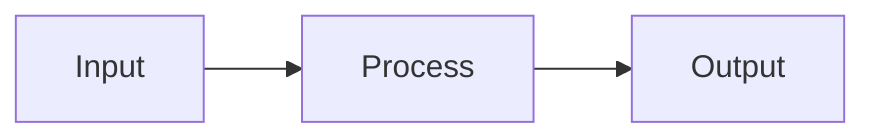
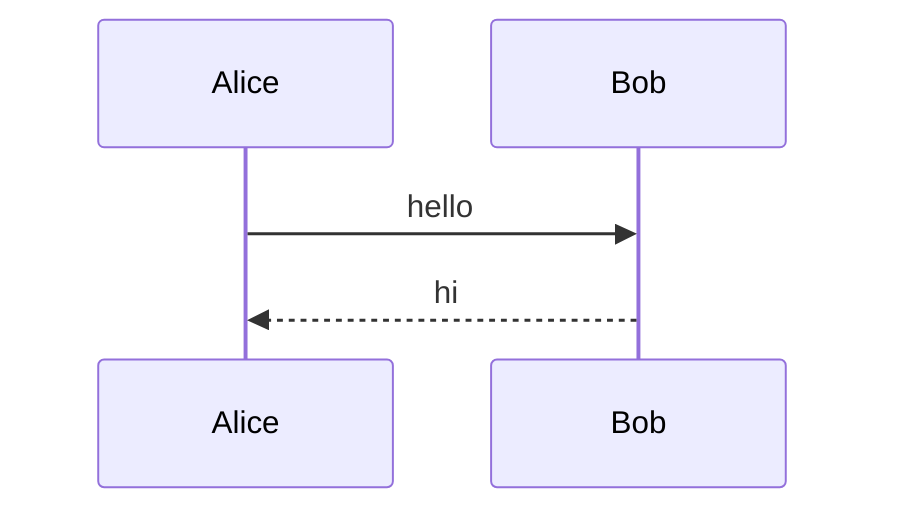

# markviz authoring skill

You are writing markdown for [markviz](https://github.com/user/markviz) — a local-first markdown viewer optimized for research notes. The user reads these notes in markviz and uses its features to learn from them.

## What makes a great markviz note

1. **A clear H1 title** — markviz shows it in the browser tab and uses it as the node label in the knowledge graph. Always start with `# Title` on the first line.
2. **Wikilinks between concepts** — when a note depends on another concept, link it: `[[that concept]]`. The reader can navigate, and the knowledge graph view shows the connection.
3. **Flashcards at the end** for anything quiz-worthy. The user studies these later.
4. **Math, code, and diagrams inline** — render real understanding, not paraphrased descriptions.
5. **Tags `#topic`** for cross-cutting themes (e.g. `#optimization` across many notes).

## Syntax reference

### Headings
```markdown
# Top-level title  (the H1 — exactly one per note)
## Section
### Subsection
```

### Wikilinks
```markdown
[[transformers]]              # link to transformers.md (basename match)
[[transformers|attention]]    # custom display text
[[transformers#Multi-head]]   # deep-link to a heading
```

**Use wikilinks for conceptual references**, not navigational ones. "This relies on [[attention]]" is conceptual; "see the full guide [here](./full-guide.md)" is navigational.

### Tags
```markdown
This note is tagged #machine-learning and #optimization.
```
Tags become clickable pills. Use for cross-cutting themes the user might filter by later.

### Math (KaTeX)
```markdown
Inline: $E = mc^2$ — single dollar signs.

Block:
$$
\int_0^\infty e^{-x^2} dx = \frac{\sqrt{\pi}}{2}
$$

Aligned:
$$
\begin{aligned}
a &= b + c \\
  &= 2b
\end{aligned}
$$
```

### Code with syntax highlighting
````markdown
```python
def fib(n):
    return n if n < 2 else fib(n-1) + fib(n-2)
```

```cuda
__global__ void kernel(float* x) { ... }
```
````
Supported langs include python, typescript, rust, go, c, cpp, cuda (use cpp), glsl, hlsl, wgsl, bash, sql, yaml, json, dockerfile, mermaid, and more. Code blocks get line numbers and a copy button automatically.

### Mermaid diagrams
````markdown



````
Use mermaid for flows, sequences, state machines, class diagrams. Don't ASCII-art when mermaid can do it cleanly.

### Flashcards — IMPORTANT FORMAT

This is the format markviz expects. **Always use the fenced block form, not inline `??::`, for sets of cards.** Put cards at the end of conceptual sections so the user can quiz themselves after reading.

````markdown
```flashcards
Q: What is the attention formula?
A: $\text{softmax}\!\left(\frac{QK^\top}{\sqrt{d_k}}\right) V$

Q: Why divide by sqrt(d_k)?
A: To keep softmax in a regime where gradients don't vanish. Without it, dot products grow with d_k and saturate softmax.

Q: What does multi-head attention add?
A: Parallel heads with learned projections — each can specialize on different patterns (syntax, coreference, etc.).
#tag: ml, transformers
```
````

Card rules:
1. **One concept per card.** "What are the 4 properties of X" → split into 4 cards.
2. **Answers are complete thoughts**, not fragments. "$\sqrt{d_k}$" is bad; "$\sqrt{d_k}$ — the scaling that keeps softmax gradients alive" is good.
3. **Front-load fundamentals.** First cards = core formulas/definitions. Later cards = edge cases, tricks.
4. **Math in answers is great.** KaTeX renders.
5. **No more than 12 cards per note** — past that, split the note.

Inline `??::` exists too — use it when one card belongs naturally in the prose:

```markdown
The chain rule generalizes derivatives:

?? What is the chain rule?
:: $\frac{d}{dx} f(g(x)) = f'(g(x)) \cdot g'(x)$

But for our purposes...
```

### HTML artifacts
For interactive visualizations, use sandboxed HTML:

````markdown
```html-artifact
<canvas id="c" width="600" height="240"></canvas>
<script>
  // ... interactive viz
</script>
```
````
Runs in a sandboxed iframe. No network access, no parent DOM. Auto-resizes. Use sparingly — only when interactivity adds real understanding.

### Runnable Python
For code the user might want to execute:

````markdown
```python-run
def fib(n):
    a, b = 0, 1
    for _ in range(n):
        yield a
        a, b = b, a + b

print(list(fib(10)))
```
````
Pyodide runs it in the browser. Stick to stdlib (numpy works but downloads on first use). Don't use for code that's the *subject* of the lesson — use for code the user might tweak.

### Tables, blockquotes, footnotes, task lists
Standard GFM. Use tables for comparisons (e.g. "complexity of different sort algorithms"). Use blockquotes for quoted source material with attribution.

## Structure template for a research note

```markdown
# {Title}

> {One-sentence elevator pitch — why this note exists}

{Optional: tags as `#tag1 #tag2`}

## Core idea

{The single most important insight, stated in 2-3 sentences. If the reader skims only one paragraph, this is it.}

## {Section heading — usually mechanics / derivation / how-it-works}

{Detailed explanation with math, code, diagrams as needed.}

## {Section — examples / applications / nuances}

{Concrete examples. Show, don't just tell.}

## Related

- [[adjacent concept 1]]
- [[adjacent concept 2]]
- [[prerequisite]] — what to read first if confused

## Flashcards

```flashcards
Q: ...
A: ...
```
```

## What to AVOID

- **Don't write summaries** — these notes are themselves the summary. Don't conclude with "In summary, we covered..." — the user just read it.
- **Don't include disclaimers** like "Note that this is a simplified treatment". The user knows.
- **Don't repeat the title** in the first paragraph.
- **Don't use horizontal rules `---`** to separate every section — headings do that.
- **Don't add emoji to headings** unless the user does.
- **Don't say "let me know if you want X"** — this isn't a chat, it's a document.
- **Don't ASCII-art when mermaid would do it cleanly.**
- **Don't write `[Concept](concept.md)` when `[[concept]]` does the same job better.**

## When to split notes

A markviz note should fit comfortably in one "study session" — roughly 10 minutes of reading. If you're over ~600 words on one topic, split into two notes and link them with `[[wikilinks]]`. Smaller notes graph better, link better, and quiz better.

## When generating multiple notes

If the user asks for notes on a multi-faceted topic:
1. **Make a hub note** named after the topic that links out to sub-notes
2. **Each sub-note is self-contained** — readable without the hub
3. **Cross-link liberally between sub-notes** with `[[wikilinks]]` when concepts depend on each other
4. **Use consistent filenames** — kebab-case, descriptive, no dates. `attention-mechanism.md` not `2026-05-16-attention.md`

This produces a knowledge graph the user can actually navigate.
