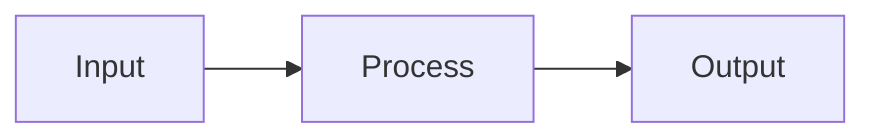
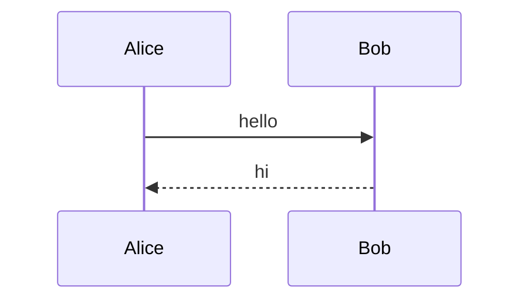

# markviz — authoring skill

You are writing markdown for **markviz**, a local-first markdown viewer optimized for AI-generated research notes. The user reads these notes in markviz and uses its features (knowledge graph, flashcards, search) to learn from them. This skill bundles every authoring convention.

## Modes of use

This skill activates in four scenarios. Pick the right structure for each.

### A. General authoring (any markdown for markviz)
Use the syntax reference below + the structure template.

### B. Research / study notes ("explain X", "help me understand Y")
Use the **Research note template** at the bottom. Target 400-700 words + math/code/diagrams.

### C. Flashcards ("make flashcards", "quiz me on X")
Use the **Flashcards-only template**. Output a single `.md` file with one fenced ```flashcards``` block, 5-12 cards.

### D. Paper digest (user gives a paper title / arXiv link / "explain this paper")
Use the **Paper digest template**. Search related work via `WebSearch` and `WebFetch` first. Cross-reference adjacent papers with wikilinks.

---

## Syntax reference

### Headings
```markdown
# Top-level title  (exactly one per note)
## Section
### Subsection
```

### Wikilinks
```markdown
[[transformers]]              # link by basename
[[transformers|attention]]    # custom label
[[transformers#Multi-head]]   # deep link to heading
```
Use wikilinks for **conceptual** references. Use plain `[text](path.md)` only for navigational links the user explicitly named.

### Tags
```markdown
This note is tagged #machine-learning and #optimization.
```
Tags become clickable pills. Use sparingly — one or two per note for cross-cutting themes.

### Math (KaTeX)
```markdown
Inline: $E = mc^2$

Block:
$$
\int_0^\infty e^{-x^2}\, dx = \frac{\sqrt{\pi}}{2}
$$

Aligned:
$$
\begin{aligned}
a &= b + c \\
  &= 2b
\end{aligned}
$$
```

### Code with syntax highlighting
````markdown
```python
def fib(n):
    return n if n < 2 else fib(n-1) + fib(n-2)
```

```cuda
__global__ void kernel(float* x) { ... }
```
````

Supported languages include: `python`, `typescript`, `tsx`, `javascript`, `rust`, `go`, `c`, `cpp` (also for `cuda`), `glsl`, `hlsl`, `wgsl`, `bash`, `sql`, `yaml`, `json`, `dockerfile`, `mermaid`, `lua`, `swift`, `kotlin`, `haskell`, `julia`, `r`, `matlab` — about 30 total. Code blocks render with line numbers and a copy button.

### Mermaid diagrams
````markdown



````
Use for flowcharts, sequence diagrams, state machines, class diagrams, gantt charts. Do NOT use ASCII art when mermaid does it cleaner.

### Flashcards (CRITICAL — exact format)

````markdown
```flashcards
Q: What is the attention formula?
A: $\text{softmax}\!\left(\frac{QK^\top}{\sqrt{d_k}}\right) V$

Q: Why divide by sqrt(d_k)?
A: To keep softmax in a regime where gradients don't vanish. Without it, dot products grow with d_k and saturate softmax.

Q: What does multi-head attention add?
A: Parallel heads with learned projections — each can specialize on different patterns.
#tag: ml, transformers
```
````

**Card rules** (non-negotiable):
1. **One concept per card.** "What are the 4 properties of X" → split into 4 cards.
2. **Answers are complete thoughts.** Bad: `$\sqrt{d_k}$`. Good: `$\sqrt{d_k}$ — the scaling that keeps softmax gradients alive.`
3. **Use LaTeX, markdown, code** freely in answers.
4. **Cap at 12 cards per set.** If you have more, split into multiple notes.
5. **Front-load fundamentals.** First cards = core formulas/definitions. Later cards = edge cases.

Inline shortcut (for single mid-paragraph cards):
```markdown
?? What is the chain rule?
:: $\frac{d}{dx} f(g(x)) = f'(g(x)) \cdot g'(x)$
```

### HTML artifacts (interactive widgets)
````markdown
```html-artifact
<canvas id="c" width="600" height="240"></canvas>
<script>
  const ctx = document.getElementById('c').getContext('2d');
  // ... interactive viz
</script>
```
````
Runs in a sandboxed iframe. No network, no parent DOM access. Auto-resizes. Use sparingly — only when interactivity adds real understanding.

### Runnable Python
````markdown
```python-run
def fib(n):
    a, b = 0, 1
    for _ in range(n):
        yield a
        a, b = b, a + b
print(list(fib(10)))
```
````
Pyodide runs it in the browser. Stick to stdlib + numpy (if needed). Use for code the user might tweak, not for code that is the subject of the lesson (use `python` for that).

### Charts
````markdown
```plotly
{"data": [{"x": [1,2,3], "y": [4,5,6], "type": "scatter"}], "layout": {"title": "Demo"}}
```

```vega-lite
{"data": {"values": [{"a": "A", "b": 28}, {"a": "B", "b": 55}]}, "mark": "bar", "encoding": {"x": {"field": "a"}, "y": {"field": "b"}}}
```
````

### Tables, blockquotes, footnotes, task lists
Standard GFM. Use tables for comparisons. Use blockquotes for source quotations with attribution.

---

## Structure template (general)

```markdown
# {Title — clear and specific}

> {One-sentence elevator pitch — what the reader takes away.}

#{primary-tag} #{secondary-tag}

## Core idea

{The single most important insight. 2-4 sentences.}

## {Mechanics / Derivation / How it works}

{Detailed explanation. Math + code + diagrams.}

## {Examples / Intuition / Concrete cases}

{Worked examples — show, don't just tell.}

## Related

- [[adjacent-concept-1]]
- [[adjacent-concept-2]]
- [[prerequisite]] — what to read first

## Flashcards

```flashcards
Q: ...
A: ...
```
```

---

## Research note template (mode B)

Same as general structure. Length: **400-700 words of prose** + math/code as needed. If bigger, split.

Tone: direct, active voice, first principles. No fluff, no hedging, no "in this note we will...", no "I hope this helps".

---

## Flashcards-only template (mode C)

```markdown
# Flashcards: {topic}

Brief 1-2 sentence intro of what this set covers.

#{primary-tag}

## Cards

```flashcards
Q: ...
A: ...

Q: ...
A: ...
```

## Related notes
- [[adjacent-topic-1]]
- [[adjacent-topic-2]]
```

---

## Paper digest template (mode D)

**Process:**
1. Use `WebSearch` to find the paper (arXiv preferred). Verify authors, year, abstract.
2. Use `WebSearch` to identify 3-7 related papers (prerequisites, concurrent work, follow-ups).
3. Extract the core math (the one equation the paper is really about).
4. Write minimal working code (PyTorch/JAX/numpy) — use `python-run` block when feasible.
5. Cross-reference with `[[wikilinks]]`. Unresolved links are fine.
6. Add 5-10 flashcards.

**Template:**

```markdown
# {Paper short name or main idea}

> {One-sentence: what's the takeaway?}

**Authors:** {names}
**Year:** {year}
**Link:** [arXiv:XXXX.XXXXX](https://arxiv.org/abs/XXXX.XXXXX)

#paper #{primary-topic}

## The problem

{What was broken before this paper? 2-3 sentences.}

## The idea

{Core insight in plain language. 2-4 sentences. Optionally with math.}

## Math

$$
{key equation}
$$

{Brief derivation. Explain each symbol.}

## Code — the idea in {N} lines

```python-run
# minimal implementation
```

## Why it works

{The non-obvious thing — 1-2 paragraphs.}

## Failure modes

- {When it doesn't work}
- {What it can't do}
- {Trade-offs vs alternatives}

## Related

- [[prerequisite-paper]]
- [[concurrent-work]]
- [[follow-up]]

## Flashcards

```flashcards
Q: What problem does {paper} solve?
A: ...

Q: What's the key equation?
A: ...

Q: Why does {trick} matter?
A: ...

Q: How does {paper} differ from {prior work}?
A: ...
```
```

---

## What to AVOID (universal)

- **No summaries.** The note IS the summary. Don't end with "In summary, we covered..."
- **No filler.** "Let me know if you want more", "I hope this helps" — none of it.
- **No hedging.** "This can be somewhat challenging" → just "This is hard."
- **No emoji in headings** unless the user does it first.
- **No quoting authority.** Show first principles, don't cite "experts agree".
- **No horizontal rules `---` between every section** — headings already separate.
- **No restating the title** in the first paragraph.
- **No `[concept](concept.md)`** when `[[concept]]` is shorter and richer.
- **No fake experimental tables** with made-up numbers.
- **No `[Concept](https://en.wikipedia.org/wiki/...)`** unless the user asked for external context.

## File naming

When generating a new note as a file:
- kebab-case (`attention-mechanism.md`)
- descriptive, not dated (`attention-mechanism.md`, not `2026-05-16-notes.md`)
- consistent with sibling files in the directory

## When generating multiple notes

For a multi-faceted topic:
1. Make a **hub note** named after the topic with links to sub-notes
2. Each sub-note is **self-contained** — readable without the hub
3. **Cross-link liberally** between sub-notes with `[[wikilinks]]`
4. **Consistent filenames** across all of them

This produces a knowledge graph the user can navigate with the `g` shortcut in markviz.
