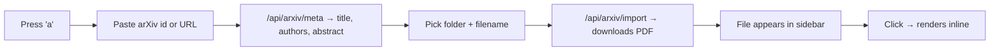

# PDFs & arXiv in markviz

> Drop any `.pdf` into your notes folder — markviz renders it inline. Press `a` to pull a paper straight from arXiv.

#feature #papers #pdf

## What's new

## Improtant 


Two things you can do now that you couldn't before:

1. **Open `.pdf` files.** They render page-by-page in the viewer with their own zoom + page navigation. No "download to read" round-trip.
2. **Import arXiv papers.** Press <kbd>a</kbd>, paste an arXiv id or URL, pick where to save the PDF, hit download. The paper lands wherever you want and shows up in the sidebar like any other file.

PDFs are first-class — the sidebar shows a PDF icon, [[wikilinks]] resolve to them like any other note, and the live-reload watcher picks up new PDFs the moment you drop one in.

## Try it now

Press <kbd>a</kbd>, paste `1706.03762` (Attention Is All You Need), and pick this folder as the destination. The PDF lands next to this note as `attention-is-all-you-need.pdf` and shows up in the sidebar immediately. Click it — the viewer flips into PDF mode, lays out all pages, and gives you a toolbar with page nav (◀ / ▶) + a zoom slider that's independent of markviz's global zoom.

The PDF text is **selectable** — drag across a paragraph and Ctrl+C copies real text, not pixels. Jump to a specific page by typing into the page number box, or deep-link to one from a note: `[link](./attention-is-all-you-need.pdf#p=3)` opens the PDF at page 3. Wikilinks work the same way: `[[attention-is-all-you-need#p=3]]`.

When you're viewing a PDF, the toolbar shows an **Open notes / Create notes** button. It looks for a sibling `.md` file with the same basename in the same folder — if it exists, one click jumps to it; if not, markviz drops a templated note next to the PDF for you.

## How the import works

Under the hood:



The id parser accepts whatever you paste:

| Form | Example |
|------|---------|
| New-style id | `2305.12345` |
| With version | `2305.12345v2` |
| Old-style id | `math/0211159` |
| Full abs URL | `https://arxiv.org/abs/1706.03762` |
| Full pdf URL | `https://arxiv.org/pdf/1706.03762.pdf` |

## Where files go

There's no "papers/" convention — markviz doesn't care. The default destination in the import dialog is the folder of the note you're currently reading (or the root, if you're not in one). Override it to anything you want. PDFs scattered across your tree all render the same way.

A few patterns that work:

- **Drop next to a note.** Reading `transformers.md`? Save the paper as `transformers.pdf` in the same folder. The two sit side-by-side; you can wikilink from one to the other.
- **Per-topic folder.** `reinforcement-learning/sutton-barto.pdf`, `optimization/adam.pdf`, etc.
- **Inbox folder.** Dump everything in `/inbox/` then move things as you read.

## Math still works around PDFs

Just because a PDF lives next to a note doesn't mean the note has to be sparse. The same KaTeX math, code blocks, mermaid, and flashcards all render normally:

$$
\text{Attention}(Q, K, V) = \text{softmax}\!\left(\frac{Q K^\top}{\sqrt{d_k}}\right) V
$$

The PDF is the source. The markdown next to it is where you think.

## Related

- [[transformers]] — the topic the attached paper belongs to
- [[knowledge-base]] — how notes link together
- [[algorithms]]
- [[attention-is-all-you-need#p=3]] — jump straight to page 3 of the PDF

## Flashcards

```flashcards
Q: How do you import an arXiv paper into markviz?
A: Press `a`, paste the arXiv id or URL, pick the destination folder + filename, then click "Download PDF".

Q: Does markviz require PDFs to live in a specific folder?
A: No — drop them anywhere in your tree. The sidebar picks them up automatically and they render inline when clicked.

Q: What forms of arXiv id does the import accept?
A: New-style (`2305.12345`), versioned (`2305.12345v2`), old-style (`math/0211159`), and full abs/pdf URLs.

Q: How does the PDF zoom relate to the global markviz zoom?
A: The PDF viewer has its own zoom slider in its toolbar, applied on top of the global zoom — so you can read a dense PDF at 150% without enlarging the rest of the UI.

Q: What endpoint actually downloads the file server-side?
A: `POST /api/arxiv/import` with `{ id, subdir, filename }`. It fetches from arxiv.org, sanitizes the path against traversal, and writes into the root.
```
