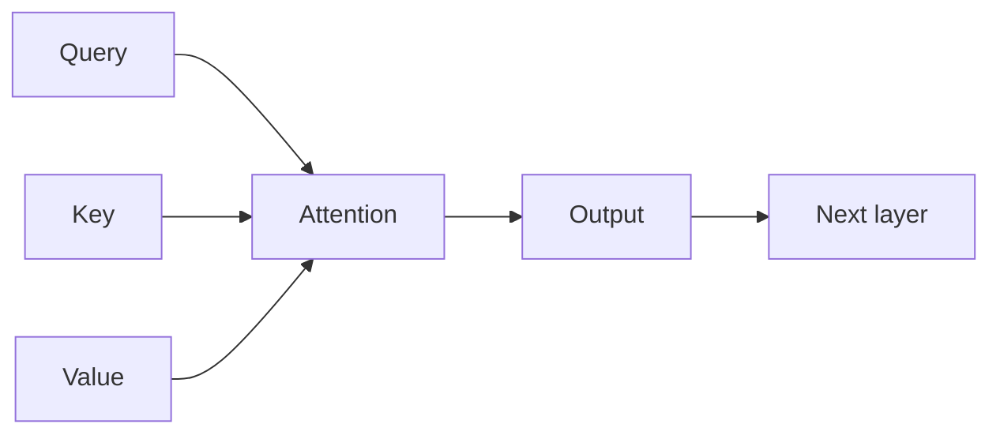
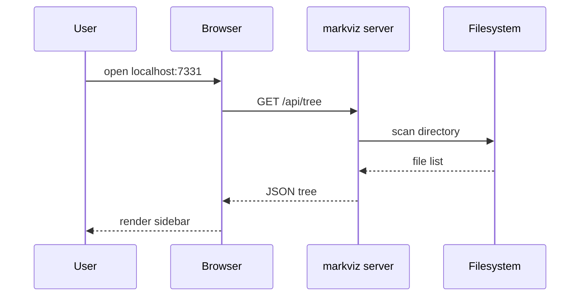
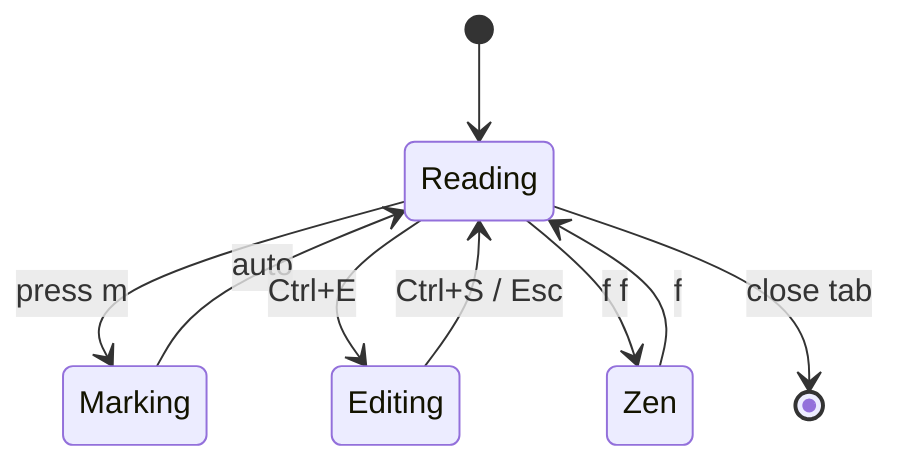
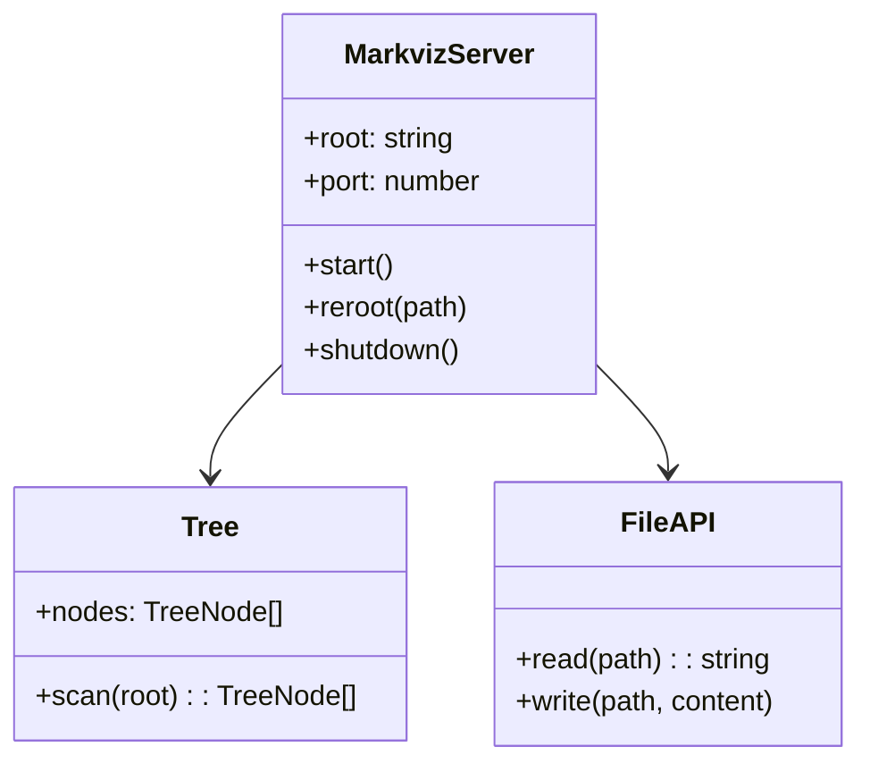
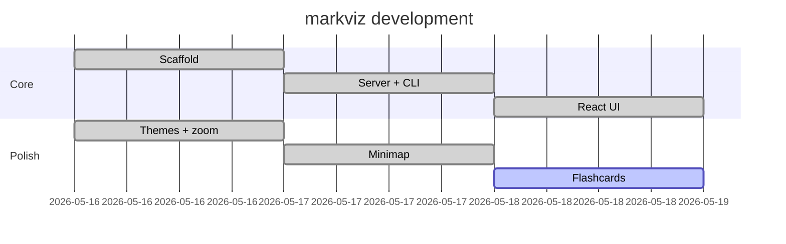

# Diagrams & HTML artifacts

markviz renders Mermaid diagrams and sandboxed HTML artifacts inline.

## Mermaid

### Flowchart



### Sequence diagram



### State diagram



### Class diagram



### Gantt



---

## HTML artifacts

A sandboxed iframe that renders your HTML/CSS/JS. Auto-resizes to content.

### Interactive canvas

```html-artifact
<canvas id="c" width="600" height="240" style="border-radius: 6px; background: linear-gradient(135deg, #1a212b, #0d1117); display: block;"></canvas>
<script>
const canvas = document.getElementById('c');
const ctx = canvas.getContext('2d');
let t = 0;
function draw() {
  const W = canvas.width, H = canvas.height;
  ctx.fillStyle = 'rgba(13, 17, 23, 0.18)';
  ctx.fillRect(0, 0, W, H);
  for (let i = 0; i < 50; i++) {
    const a = t * 0.01 + i * 0.15;
    const x = W/2 + Math.cos(a) * (i * 4 + 30);
    const y = H/2 + Math.sin(a * 1.3) * 60;
    ctx.beginPath();
    ctx.arc(x, y, 3 + Math.sin(t * 0.02 + i) * 1.5, 0, Math.PI * 2);
    ctx.fillStyle = `hsla(${(i * 7 + t * 0.5) % 360}, 70%, 60%, 0.85)`;
    ctx.fill();
  }
  t++;
  requestAnimationFrame(draw);
}
draw();
</script>
```

### Static UI

```html-artifact
<div style="padding: 24px; background: #161b22; color: #e6edf3; border-radius: 8px; border: 1px solid #2a313c;">
  <h2 style="margin-top: 0;">A neural network in HTML</h2>
  <svg width="100%" height="200" viewBox="0 0 400 200">
    <g stroke="#4f8cff" stroke-width="0.8" fill="none" opacity="0.6">
      <line x1="40" y1="40" x2="200" y2="40" /><line x1="40" y1="40" x2="200" y2="100" /><line x1="40" y1="40" x2="200" y2="160" />
      <line x1="40" y1="100" x2="200" y2="40" /><line x1="40" y1="100" x2="200" y2="100" /><line x1="40" y1="100" x2="200" y2="160" />
      <line x1="40" y1="160" x2="200" y2="40" /><line x1="40" y1="160" x2="200" y2="100" /><line x1="40" y1="160" x2="200" y2="160" />
      <line x1="200" y1="40" x2="360" y2="100" /><line x1="200" y1="100" x2="360" y2="100" /><line x1="200" y1="160" x2="360" y2="100" />
    </g>
    <g fill="#4f8cff">
      <circle cx="40" cy="40" r="10" /><circle cx="40" cy="100" r="10" /><circle cx="40" cy="160" r="10" />
      <circle cx="200" cy="40" r="10" /><circle cx="200" cy="100" r="10" /><circle cx="200" cy="160" r="10" />
      <circle cx="360" cy="100" r="10" />
    </g>
    <g fill="#9aa4b2" font-family="Inter, sans-serif" font-size="11" text-anchor="middle">
      <text x="40" y="190">input</text>
      <text x="200" y="190">hidden</text>
      <text x="360" y="190">output</text>
    </g>
  </svg>
</div>
```

---

## Runnable Python

Press **Run** below to execute the Python in your browser via [Pyodide](https://pyodide.org/) — no server, no install. The first run downloads Pyodide (~10 MB) and is slower; subsequent runs are instant.

```python-run
# Compute the first 10 Fibonacci numbers
def fib(n):
    a, b = 0, 1
    for _ in range(n):
        yield a
        a, b = b, a + b

print(list(fib(10)))
print(f"Sum: {sum(fib(20))}")
```

```python-run
# A tiny demo: gradient descent on a quadratic
def f(x):
    return (x - 3) ** 2 + 1

def grad(x):
    return 2 * (x - 3)

x = 0.0
lr = 0.1
for step in range(15):
    x -= lr * grad(x)
    print(f"step {step:2d}: x = {x:.4f}, f(x) = {f(x):.4f}")
```

```python-run
# String processing — works in pure Python (no torch/numpy needed for these)
import re

text = """When you ask Claude (or any LLM) to research something,
you get back markdown. Lots of it."""

words = re.findall(r"\w+", text.lower())
counts = {}
for w in words:
    counts[w] = counts.get(w, 0) + 1

# Top-5 words
top = sorted(counts.items(), key=lambda kv: -kv[1])[:5]
for word, n in top:
    print(f"{word:>10}  {n}")
```
