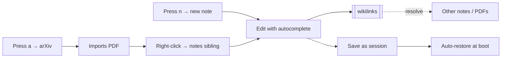

# What's new in markviz

> A quick tour of every feature added in this round. Open this in markviz and click through.

#showcase #features

## At a glance

- **PDF viewer with text selection, chapters, deep links** — drop any `.pdf` and it renders inline.
- **arXiv import** — `a` for single, "Bulk" tab for many.
- **Split view + tabs** — `Ctrl+\` for two panes; alt-click in sidebar to send to right pane. Each pane has its own tab strip (Ctrl+Tab cycles, Ctrl+W closes, middle-click closes).
- **6 new themes + theme studio** — accent picker, font pickers, save as named theme.
- **Reading overlays** — night / sepia / dim / high-contrast tints over the whole UI.
- **Sessions** — save the current layout (including every open tab in each pane) as a named workspace; auto-restored at boot.
- **Daily notes** — `Ctrl+Shift+D` opens today's note from a configurable template.
- **Wikilink autocomplete** — type `[[` in the editor for a fuzzy-search popover.
- **New note** — press `n` to create a file anywhere in the tree.
- **File management** — right-click any file/folder in the sidebar for rename / move / duplicate / delete.
- **Settings page** — `,` for a centralized panel covering theme, reading, editor, daily notes, files, shortcuts.

## How the workflows compose



## Try it now

A 90-second test you can run:

1. Press <kbd>n</kbd> — type `scratch/today` — Enter. Editor opens.
2. In the editor, type `[[wel` — the autocomplete pops up. Pick `welcome`. The `]]` closes itself.
3. Press <kbd>Esc</kbd> to exit the editor.
4. Press <kbd>Ctrl+\\</kbd>. The pane you were in becomes the left pane; the right pane is empty.
5. Alt-click another file in the sidebar — it opens on the right.
6. Open the **Sessions** panel (bookmark icon in the topbar). Save as "test layout". Reload the page — markviz comes back exactly the way you left it.
7. Press <kbd>,</kbd> for settings. Switch to **Reading** and try the Night overlay.
8. Press <kbd>a</kbd>. Click "Bulk". Paste:
   ```
   1706.03762
   2010.11929
   ```
   Click "Look up all", then "Download 2 PDFs". They land in your current folder.
9. Open one of the PDFs — chapters appear in the left rail; drag-select text + Ctrl+C copies real text.
10. Right-click any file in the sidebar — rename, move, duplicate, or delete with confirmation.

## Keyboard reference (the short version)

| Key | What it does |
|-----|--------------|
| <kbd>n</kbd> | New note |
| <kbd>a</kbd> | Import arXiv paper |
| <kbd>,</kbd> | Settings |
| <kbd>Ctrl</kbd>+<kbd>P</kbd> | Quick open |
| <kbd>Ctrl</kbd>+<kbd>Shift</kbd>+<kbd>F</kbd> | Full-text search |
| <kbd>Ctrl</kbd>+<kbd>B</kbd> | Sidebar |
| <kbd>Ctrl</kbd>+<kbd>M</kbd> | Minimap |
| <kbd>Ctrl</kbd>+<kbd>\\</kbd> | Split view |
| <kbd>Ctrl</kbd>+<kbd>Tab</kbd> | Next tab in active pane |
| <kbd>Ctrl</kbd>+<kbd>W</kbd> | Close current tab |
| <kbd>Ctrl</kbd>+<kbd>E</kbd> | Edit / view |
| <kbd>Ctrl</kbd>+<kbd>S</kbd> | Save (in editor) |
| <kbd>Ctrl</kbd>+<kbd>Shift</kbd>+<kbd>D</kbd> | Today's daily note |
| <kbd>Ctrl</kbd>+<kbd>Shift</kbd>+<kbd>P</kbd> | Print / save as PDF |
| <kbd>?</kbd> | Help overlay |

## What deep-research can do for you

Markviz ships a Claude Code skill called `markviz-deep-research`. Run `markviz skills install` if you haven't yet, then ask Claude: *"Deep research on {topic}, save outputs to research/{topic-slug}/"*. It:

1. Reads what you already have in the project.
2. Asks at most 3 clarifying questions (skipped if your topic is specific).
3. Writes a plan to `research/{topic}/plan.md`.
4. Searches arXiv + Semantic Scholar, triages, imports the relevant PDFs.
5. Writes 5-10 dense paper digests with verifiable quotes + page references.
6. Writes an `index.md` nomenclature note with cross-refs and a `questions.md` for open threads.

Every non-trivial claim is required to have a citation or be marked `[unverified]` — so you can audit later.

## Where things live on disk

- `daily/YYYY-MM-DD.md` — daily notes
- `papers/` (or anywhere) — PDFs
- `research/{topic}/` — output of the deep-research skill
- `.markviz/sessions.json` — your saved layouts
- `.markviz/srs.json` — flashcard SRS progress
- `.markviz/daily-template.md` — your daily-note template

Everything is plain files. You can `git` it, sync it via Dropbox/Syncthing, or pipe it into something else. markviz never locks you in.

## Flashcards on what you read here

```flashcards
Q: What's the shortcut for the settings page?
A: Press `,` (comma).

Q: How do you import multiple arXiv papers in one go?
A: Press `a`, switch to the "Bulk" tab, paste IDs/URLs (newline or comma separated), look them up, then download.

Q: Where does markviz store sessions?
A: `.markviz/sessions.json` under the notes folder root.

Q: What happens when you alt-click a file in the sidebar?
A: It opens in the right pane (split view is auto-enabled if it was closed).

Q: How does the wikilink autocomplete know what to suggest?
A: It fuzzy-searches the file index (both .md notes and .pdf files in the tree). Markdown wins on basename ties.

Q: When does markviz auto-restore a session at boot?
A: When there is no `?file=` URL parameter and a session is marked as "last used" in `.markviz/sessions.json`. The last-used marker is set when you save or load a session.
```

## Related

- [[welcome]] — start here if it's your first time
- [[knowledge-base]] — how markviz handles wikilinks + backlinks
- [[research/pdf-and-arxiv|pdf-and-arxiv]] — deep dive into the PDF + arXiv workflow
